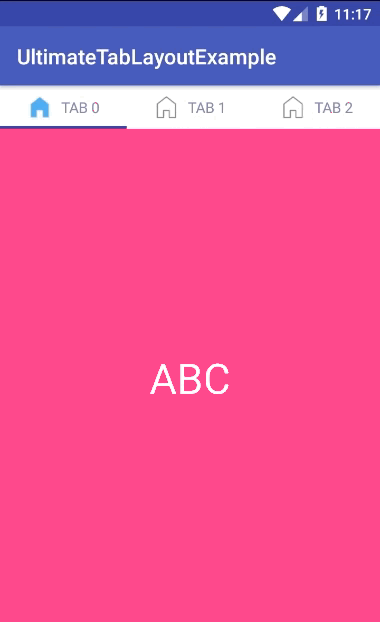
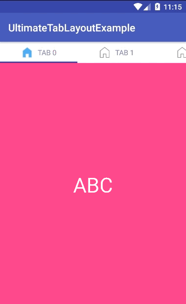
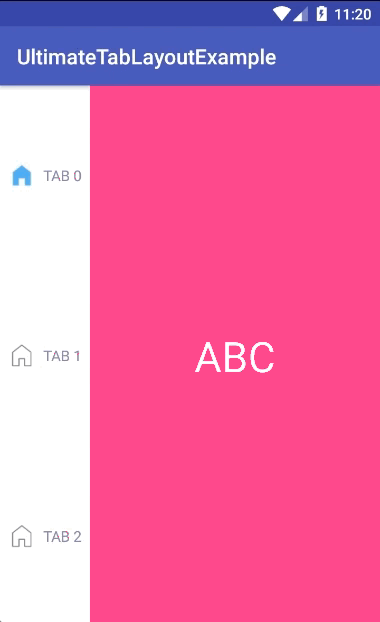
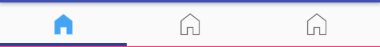
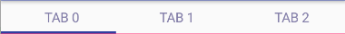

# UltimateTabLayout for ViewPager (new library, very use, full option)
UltimateTabLayout is a library that allows you to create a tab of viewpager with 2 style:
- Sling.
- Fixed.

  
  
  
  
  
  
  
  
  
  
  
  
  

---


# Table of Contents

1. [Gradle Dependency](https://github.com/ATHBK/UltimateTabLayout#gradle-dependency)
   1. [Repository](https://github.com/ATHBK/UltimateTabLayout#repository)
   2. [Dependency](https://github.com/ATHBK/UltimateTabLayout#dependency)
2. [Basic Usage](https://github.com/ATHBK/UltimateTabLayout#basic-usage)
   1. [UltimateTabLayout XML](https://github.com/ATHBK/UltimateTabLayout#ultimatetablayout-xml)
   2. [Attributes](https://github.com/ATHBK/UltimateTabLayout#ultimatetablayout-attr )
3. [Init Java](https://github.com/ATHBK/UltimateTabLayout#init-from-java)
4. [License](https://github.com/ATHBK/UltimateTabLayout#license)

   
---

# Gradle Dependency


#### Repository

Add this in your root `build.gradle` file (**not** your module `build.gradle` file):

```gradle
allprojects {
	repositories {
		...
		maven { url 'https://jitpack.io' }
	}
}
```

#### Dependency

Add this to your module's `build.gradle` file:

```gradle
dependencies {
	compile 'com.github.ATHBK:UltimateTabLayout:1.2'
}
```

---

# Basic Usage

#### UltimateTabLayout XML

To use this UltimateTabLayout in your layout simply copy and paste the xml below. This provides the default indicator. 

```xml
 <com.athbk.ultimatetablayout.UltimateTabLayout
        android:id="@+id/tabLayout"
        android:layout_width="match_parent"
        android:layout_height="wrap_content"
        app:tab_orientation="horizontal"
        app:tab_style="fixed"
        app:tab_position_icon="icon_left"
        app:tab_width="0dp"
        app:tab_under_line_color="@color/colorPrimaryDark"
/>
````

#### UltimateTabLayout Attr 

There are several other attributes that can be used to configure color text, icon, background tab, size.

| Attrrs              |                           |  type   | option                                           |
| --------------------|:-------------------------:|---------|--------------------------------------------------|
| tab_style           | style of tab layout       |enum     |sliding or fixed                                  |
| tab_text_size       | size of text              |dimension|                                                  |
| tab_text_color      | color of text             |reference|                                                  |
| tab_under_line_show | visible of under line     |boolean  |                                                  |
| tab_under_line_color| color of under line       |color    |                                                  |
| tab_width           | width of each tab         |dimension|                                                  |
| tab_height          | height of each tab        |dimension|                                                  |
| tab_padding_top     | padding top in tab        |dimension|                                                  |
| tab_padding_bottom  | padding bottom in tab     |dimension|                                                  |
| tab_padding_left    | padding left in tab       |dimension|                                                  |
|tab_padding_right	  | padding right in tab      |dimension|                                                  |
|tab_width_icon	      | width of icon             |dimension|                                                  |
|tab_height_icon      | height of icon            |dimension|                                                  |
|tab_position_icon    | posistion of icon for text|enum     |icon_left or icon_right or icon_top or icon_bottom|
|tab_padding_icon     | padding icon for text     |dimension|                                                  |
|tab_orientation      | orientation of each tab   |enum     |vertical or horizontal                            |

* Tip: only use for style's fixed.
If you want to auto align, you will tab_width = "0dp" with tab_orientation = "horizontal"
or tab_height = "0dp" with tab_orientation = "vertical"
---

# Init from Java

#### Java

How to use in . 

```java	
	adapter = new FragmentAdapterDemo(getSupportFragmentManager());
        viewPager.setAdapter(adapter);
        tabLayout.setViewPager(viewPager, adapter);
```

** Note: Adapter must implements IFTabAdapter

- If title is empty, tab will show only icon
- If icon is empty, tab will show only title
- If title and icon is'nt empty, tab will show both.

---
# License

    Copyright 2017 ATHBK

    Licensed under the Apache License, Version 2.0 (the "License");
    you may not use this file except in compliance with the License.
    You may obtain a copy of the License at

       http://www.apache.org/licenses/LICENSE-2.0

    Unless required by applicable law or agreed to in writing, software
    distributed under the License is distributed on an "AS IS" BASIS,
    WITHOUT WARRANTIES OR CONDITIONS OF ANY KIND, either express or implied.
    See the License for the specific language governing permissions and
    limitations under the License.
